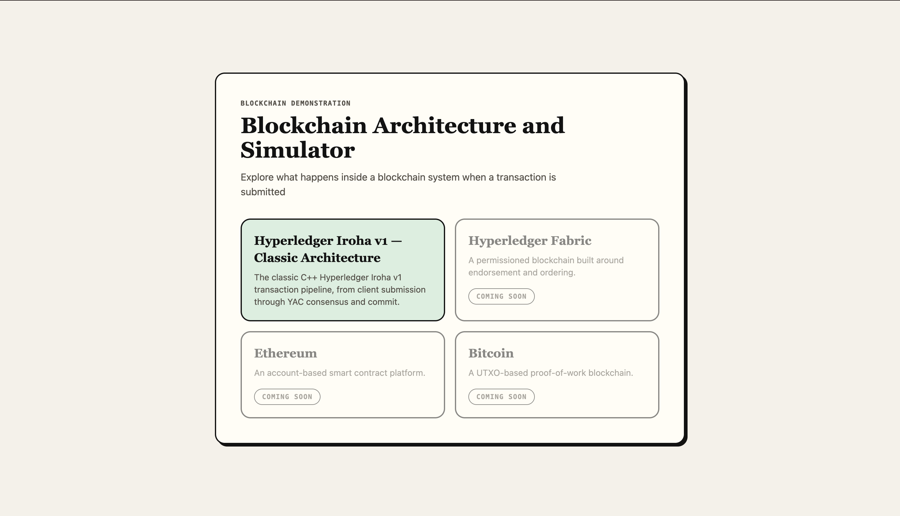
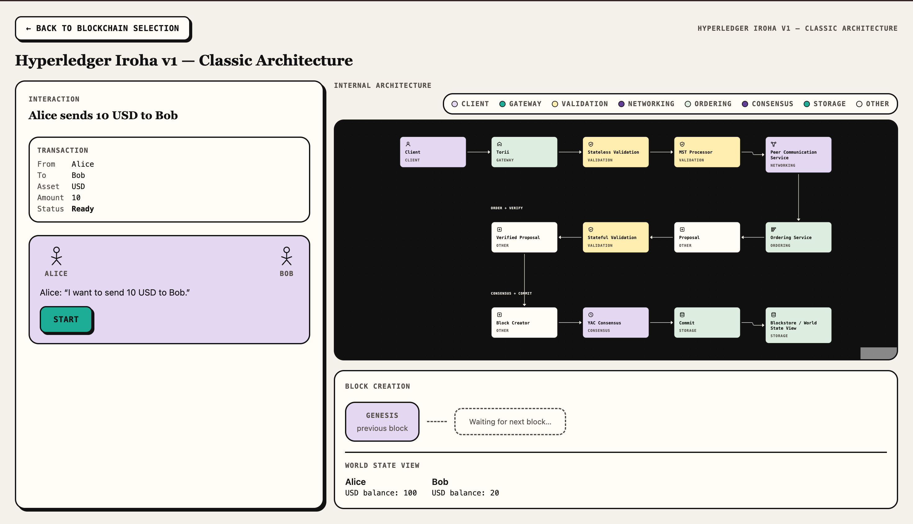

# Blockchain Architecture Simulator

An interactive educational simulator for understanding how blockchain
transactions move through internal protocol architecture. The current
implementation demonstrates the **Hyperledger Iroha v1 Classic Architecture**,
walking a single transaction through validation, ordering, consensus, and
commit.

## Features

- Interactive Iroha v1 architecture visualization with component-level detail
- Animated transaction progression through the architecture diagram
- Stateless and stateful validation
- Ordering service and proposal flow
- YAC consensus
- Commit and block creation
- World State View updates
- Repeated transaction and block history
- Component-level architecture explanations, including inputs, outputs, and
  related concepts

Hyperledger Iroha v1 uses YAC (Yet Another Consensus) to have peers agree on
a candidate block before it is committed. This classic architecture model is
what the simulator demonstrates step by step.

For official information about Hyperledger Iroha, visit the
[LF Decentralized Trust Hyperledger Iroha project page](https://lfdecentralizedtrust.org/projects/iroha).

Note: This simulator is an independent educational project and is not maintained by
or affiliated with the Linux Foundation or LF Decentralized Trust.

## Current Demonstration

- Alice begins with 100 USD and Bob with 20 USD
- Alice submits a 10 USD transfer to Bob
- The transaction passes through the Iroha architecture, including
  validation, ordering, proposal handling, and YAC consensus
- The committed transaction creates/extends the educational block chain and
  updates the World State View
- Another transaction can be executed to observe additional committed blocks
  and cumulative balances

## Simulator Snapshots

| Architecture selection | Iroha simulator |
| --- | --- |
|  |  |

## Tech Stack

### Frontend
- **React** — component-based user interface
- **TypeScript** — type-safe application development
- **Vite** — development server and production build tooling
- **Tailwind CSS** — utility-first styling and layout
- **Motion** — UI transitions and animation

### Architecture Visualization
- **React Flow (`@xyflow/react`)** — interactive architecture graph, nodes, edges, and transaction-path visualization

### State and Simulation
- **XState** — transaction simulation state machine and step progression
- **Zustand** — lightweight application-level UI and navigation state
- **Zod** — runtime validation of architecture and scenario data

### Testing
- **Vitest** — unit and integration testing
- **Playwright** — end-to-end browser testing
## Setup

**Live Demo:** [Open the deployed simulator](https://sasi-1902.github.io/Blockchain-Architecture-Simulator/)

### Local development

Requires the Node.js version specified in `.nvmrc`/`package.json` (Node 24).

```bash
git clone <repository>
cd Blockchain-Architecture-Simulator
npm ci
npm run dev
```

### Verification

```bash
npm run test
npm run e2e
npm run verify
```

## Future Work

1. More transaction/use-case scenarios, including smart-contract and
   failure-path demonstrations.
2. Peer/node network visualization showing message and consensus propagation.
3. Additional blockchain architectures, including Iroha 2 and other
   platforms.

## Author

**Sasi Deepika Eluri**

- [GitHub](https://github.com/sasi-1902)
- [LinkedIn](https://www.linkedin.com/in/sasi-deepika-eluri/)
- Email: [esasideepika@gmail.com](mailto:esasideepika@gmail.com)

## License

Licensed under the MIT License. See [LICENSE](LICENSE).
